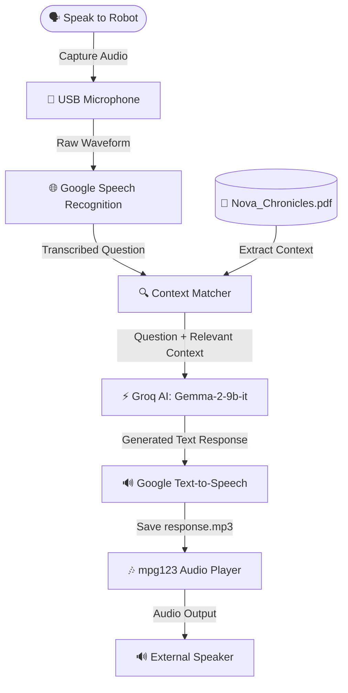

# 🤖 Voice Assistant Humanoid Bot (Nova)

Nova is an interactive, voice-controlled AI Humanoid Bot built on a **Raspberry Pi 4** platform. The robot leverages **Retrieval-Augmented Generation (RAG)** to answer story-related and context-based questions in real-time. Users speak directly to the robot using a microphone, and it retrieves text dynamically from a PDF database, queries a large language model (LLM), and responds out loud via text-to-speech.

The default configuration features **Nova**, a friendly humanoid explorer robot, answering questions about a sci-fi adventure story loaded from a local PDF (`Nova_Chronicles.pdf`).

---

## 📐 Architecture Flow

Below is how audio and data flow through the robot:



---

## 🛠️ Hardware Requirements & Setup

To assemble the physical humanoid robot, you will need the following components:

| Component | Description | Connection type |
| :--- | :--- | :--- |
| **Microcomputer** | Raspberry Pi 4 Model B (4GB or 8GB) | Core controller |
| **Microphone** | USB Microphone or USB Soundcard Adapter | USB Port |
| **Speaker** | 3.5mm Aux or USB Speaker | Audio Jack or USB Port |
| **Power Supply** | USB-C 5V 3A stable adapter | Main power input |
| **Chassis** | 3D-Printed Humanoid robot parts | Custom shell |

### 🛠️ 3D Printing & Mechanical Assembly
*   The humanoid body parts were custom 3D-printed using PLA.
*   **Acknowledgment**: Due to volume limitations on smaller hobbyist 3D printers, the **National Information Technology Development Agency (NITDA)** kindly supported the project by printing larger structural components (such as the main torso and base) on their industrial-grade printers.
*   Make sure to leave open channels in the chassis to route cables from the microphone (head area) and speakers (chest/base area) back to the Raspberry Pi ports.

---

## ⚙️ Software Installation

Follow these instructions to set up the software environment on your Raspberry Pi (or local test machine running macOS, Linux, or Windows).

### 1. System-Level Dependencies

Before installing Python packages, you must install the required audio libraries and players.

#### For Debian/Ubuntu (Raspberry Pi OS):
```bash
sudo apt-get update
sudo apt-get install -y mpg123 portaudio19-dev python3-pyaudio
```

#### For macOS (Homebrew):
```bash
brew install mpg123 portaudio
```

---

### 2. Python Environment Setup

Clone this repository and navigate to the project directory:

```bash
git clone https://github.com/your-username/voice-assistant-humanoid-bot.git
cd "voice-assistant-humanoid-bot"
```

Create a virtual environment and install the required dependencies:

```bash
# Note: Virtual environments are mandatory on newer Raspberry Pi OS releases due to PEP 668
python3 -m venv venv
source venv/bin/activate
pip install --upgrade pip
pip install -r requirements.txt
```

---

### 3. API Integration & Security 🔑

To protect your credentials from the general public when hosting code on GitHub, the script loads API keys securely from environment variables.

1.  Copy the template configuration file:
    ```bash
    cp .env.example .env
    ```
2.  Open `.env` and fill in your Groq API Key:
    ```env
    GROQ_API_KEY=gsk_your_actual_api_key_here
    ```

> [!IMPORTANT]
> The `.env` file is excluded from git commits by the `.gitignore` rule, keeping your private keys safe. Never hardcode credentials into `chatbotCodeGroq.py`.

---

## 📄 Customizing the RAG Context

The bot reads text dynamically from `Nova_Chronicles.pdf` in the root directory to build its knowledge context.

*   To test the system immediately, you can use the pre-generated `Nova_Chronicles.pdf` containing the story about Nova the explorer.
*   To use your own document (a story, guide, or school user manual), replace the `Nova_Chronicles.pdf` file with your own PDF and update the target file path in [chatbotCodeGroq.py](file:///Users/karis/Downloads/Voice%20assistant%20humanoid%20bot/chatbotCodeGroq.py):
    ```python
    pdf_file = "YourCustomFile.pdf"
    ```

---

## 🚀 Running the Bot

1.  Make sure your microphone and speaker are connected and configured as the default audio devices on your system.
2.  Start the bot script:
    ```bash
    python3 chatbotCodeGroq.py
    ```
3.  **Interaction Flow**:
    *   The bot will print `Say 'hello' to start...`
    *   Say **"hello"** out loud.
    *   The bot will respond **"Hello! How can I help you?"** and display `Listening for your question...`
    *   Ask a question related to the PDF story (e.g. *"What is Nova's mission?"* or *"What is Nova's power source?"*).
    *   The bot will process the text, retrieve relevant sections from the PDF, consult the Groq AI model, and respond out loud using its speaker.
    *   Say **"quit"** to exit the loop.

---

## 🔧 Troubleshooting

### 🔊 Audio Playback Issues
*   **No sound from speakers**: Verify `mpg123` is installed and can play files by testing it manually:
    ```bash
    mpg123 response.mp3
    ```
*   **Output Device Configuration**: On Raspberry Pi, configure the default audio output routing using `raspi-config` or selecting the correct card using `alsamixer`.

### 🎤 Microphone Recognition Issues
*   **PyAudio Installation Error**: PyAudio requires compilation against `portaudio`. Ensure you have run `sudo apt-get install portaudio19-dev` before installing Python packages.
*   **Microphone not picking up speech**:
    1.  List your connected recording devices: `arecord -l`
    2.  Open `alsamixer` in the terminal, press `F6` to select your soundcard, and adjust the capture volume level.
*   **SpeechRecognition Timeout/Failure**: Ensure the Pi has a working internet connection, as the default recognizer calls Google's Web Speech API.

### 🔌 API Authentication Errors
*   If you receive `ValueError: GROQ_API_KEY environment variable is not set`, check that:
    1.  The `.env` file exists in the exact directory where you are launching the script.
    2.  Your API key prefix is correct (typically starts with `gsk_`).

---

## 🤝 Acknowledgments

*   **NITDA**: Special thanks to the **National Information Technology Development Agency (NITDA)** for providing the 3D-printing resources required to print the humanoid body parts.
*   **Groq**: For providing lightning-fast inference infrastructure.
*   **Google & PyMuPDF**: For the speech-to-text, text-to-speech, and PDF parser engines.
